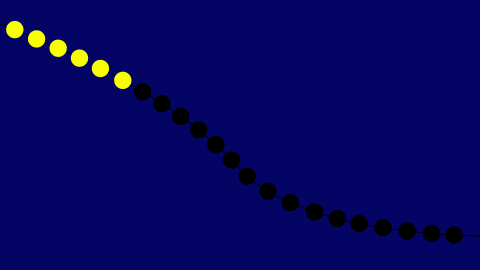
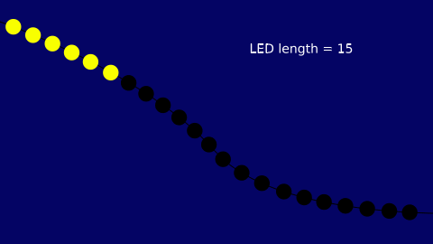
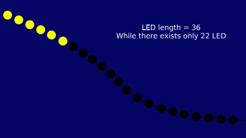
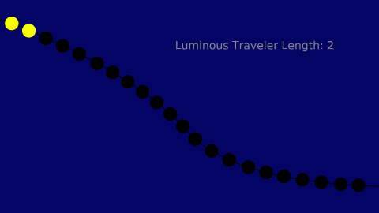
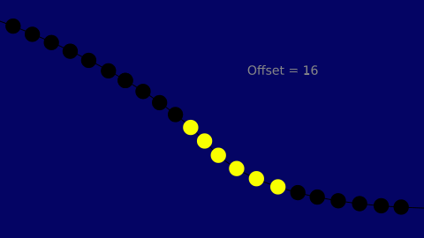
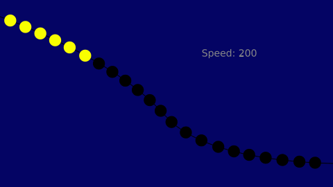
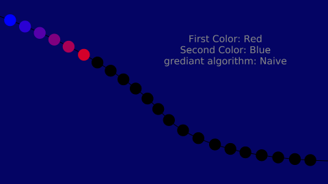
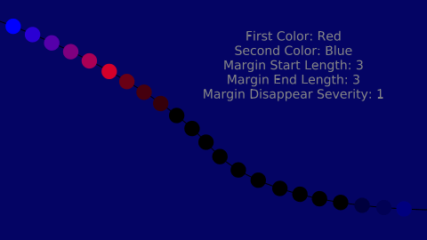

# Luminous Traveler User Manual

**Luminous Traveler** is a native effect in the light-blender system. This effect simulates a moving array of lights:

## Parameters

There are a bunch of parameters for creating your desired Luminous Traveler effect. In this section, we will describe each parameter:

### LED Length

Determine length of the LED:

For example, if you have an LED strip with length 22 and you want to use all of them, you can set the `LED length` to 22.

Please consider that you can set this value less or more than your real-world LED devices. For instance, if you have a LED strip with a `LED length` of 22 and set this parameter to 15, you will use the first 15 LEDs, like:

You can also set this value more than the real-world LED device count, for example:

### Luminous Traveler Length

This parameter specifies the length of the traveler array in LEDs.

In this example, we set the `length` of the array to 2:

### Luminous Travel Offset

This parameter specifies the starting for **JUST IN FIRST TRAVERSAL** of LED, and after exceeding the last available LED, it will use the first available LED to cross. This will help you to separate multiple luminous traveler effects when you are using light-blender to mix them together.

In this example, we set the `offset` attribute to 16:

### Speed

This parameter specifies the speed of travel in Luminous Traveler effect. The more you set this parameter, the faster the traveler will be. These GIFs illustrate how increasing the `speed` will affect the traveler:

### Start Color, End Color, Gradient Algorithm

These two attributes work together to generate a gradient. If you see both `Start` and `End` colors the same (e.g., both yellow), you will see a solid color, like our other examples. But you can set them differently to achieve a gradient color.

There are two different `gradient algorithms` to generate these colors: Naive and Spectrum.

**Naive**: Use direct mixture of two colors to generate colors.

**Spectrum**: Use colors with wavelength between `start` and `end` colors to generate colors, like a part of a rainbow:

### Margin Start Length, Margin End Length, and Margin Disappear Severity

You can add fade-in/fadeout like margins in both sides (or just one side) of the gradient. This will help your effect to seem more smooth. `Margin Disappear Severity` is another parameter related to margins which helps you to adjust the severity of fading in/out.

