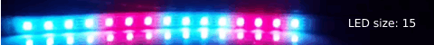
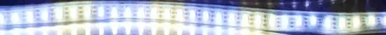
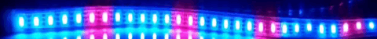

# Dashed Lights Effect For LightBlender

Dashed Lights, generates a dashed format light in a range of LED strip.

**Note**: The motion toggles between two colors repeatedly. If you do not want this toggle you can set speed to zero.

## Parameters

There are a bunch of parameters for creating your desired Dashed effect. In this section, we will describe each parameter:

### LED Length

Determine length of the LED, You can set this value less and more than your real LED Length.

### First Section Length and Second Section Length

Determine the length of the sections of dashed line.

In this example we set 5 and 2 for sections respectively:

### First Section Color And Second Section Color

These two parameters determine the colors for both sections.

In this example we used yellow and blue colors for sections:

### Effect Start and Effect End

Determine the start and endpoints of the dashed line.

In gif below we limited effect start and effect end between 5 and 25:

### Speed

Determine the speed of shifting colors between sections.

**Note**: Set the value of this parameter to 0 to have a constant dash.

Here you can see some speed parameters examples:

Speed=0:

Speed=100:

Speed=300:
