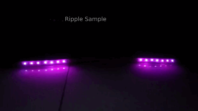

# Ripple Effect User Manual

The Ripple Effect generates an effect like a ripple in a liquid space. This effect has two tales that start from a center point, and move in opposite directions.

## parameters

### LED length

Determines the length of your device LED. Attention, you can set this parameter more or less than your real LED size to limit the operational LEDs.

### Ripple Length

This parameter determines the length of the ripple tales.

### Center

This parameter determines the center of the the ripple.

### Infinite Repeat

This parameter determines if the ripple effect should be infinitely repeatable or play just once.

### Ripple Duration

Lifetime of both tails before they fully disappear. For example if you set this parameter to 3, the tail will fully disappear after passing 3 led.

### Speed

This parameter will determine the speed of tails moving.

### Start Color, End Color and Gradient Algorithm

Start Color and End Color will determine the color of the tails start, and end respectively, this will made a gradient on both tails. Gradient Algorithm will determine how the gradient is applied. There are two different algorithms for this:

**Naive**: Use direct mixture of two colors to generate colors.

**Spectrum**: Use colors with wavelength between `start` and `end` colors to generate colors, like a part of a rainbow:

### Margin Start Length, Margin End Length, and Margin Disappear Severity

You can add fade-in/fadeout like margins in both sides (or just one side) of the gradient in each tail. This will help your effect to seem more smooth. `Margin Disappear Severity` is another parameter related to margins which helps you to adjust the severity of fading in/out.
