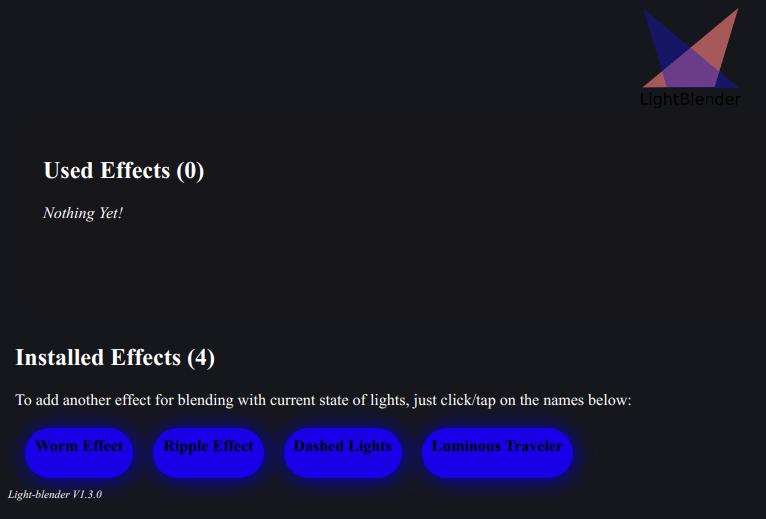
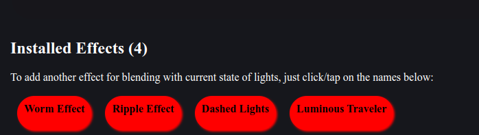
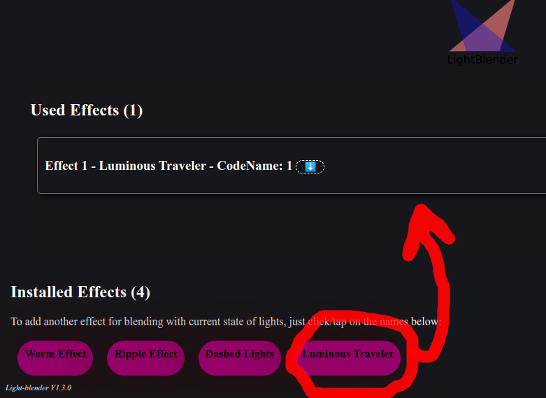
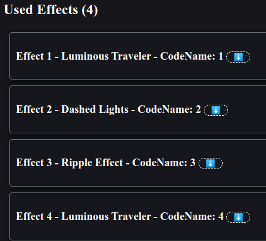
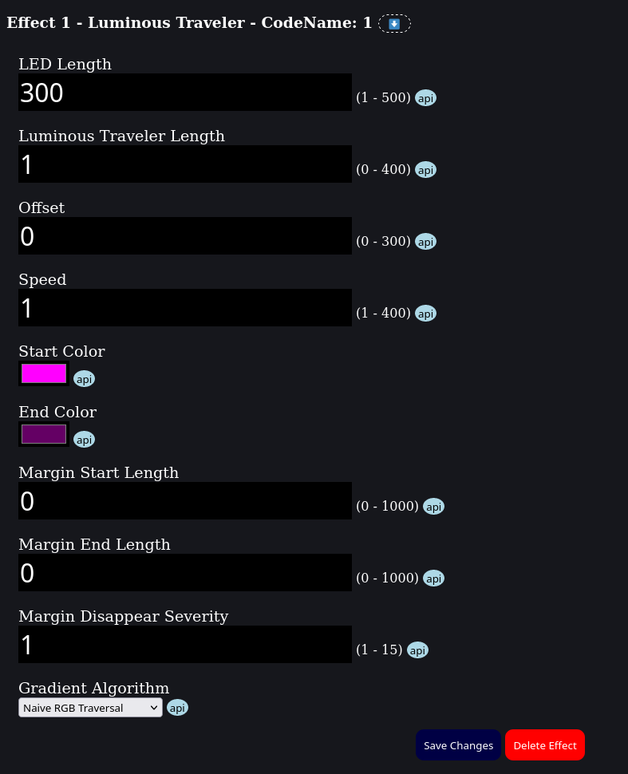

# LightBlender User Manual Introduction

LightBlender is an innovative system designed specifically for mapping on LED strips, offering users the creative freedom to design mesmerizing lighting effects. With LightBlender, users can harness a wide array of installed and pre-installed effects, along with customizable effect modifiers, to craft unique and captivating visual displays. Whether you're an experienced artist or someone with no artistic background, LightBlender provides an intuitive platform to bring your imagination to life. This user-friendly system empowers both professionals and enthusiasts to create stunning lighting sequences tailored to their preferences. Elevate your spaces, events, and projects with LightBlender, the ultimate solution for personalized LED strip lighting effects.

## General usage

Light-Blender comes with a administration page like below:

As you see in picture above, you have some effects on light-blender. Some of them are pre-installed on light-blender and some other effects are installed independently.

## How to add effects

Just a look at the bottom of administration page. You will see the list of available effects to use.

Each effect usually comes with a **its own documentation**. So try to read them if you are interested in learning more about them and their usage.

To add a new effect, click/tap on them to add an instance of it. For example, assume we want to add a new __Luminous Traveler__ effect. To achieve that, you will need to click on __Luminous Traveler__  button, and you will have an instance of it immediately.

You can add multiple effect. LightBlender will mix selected effects together and generate a mixed effect of them.

**Remember**: you can select same effect multiple times, As you can set different parameter for each effect, this can be useful for you. In picture below, __Luminous Traveler__  selected twice, And this can be really useful in many use cases.

## How to edit effect parameters

When you select an effect to use, you can click on each used effect to open editing menu and then set your desired parameters for them.

## What are the modifiers and how to use them?

Effect modifiers can be apply on effects and make changes in them.

Effect Modifiers, can be add after you create an effect. Open target edit settings by clicking on the name. in bottom of the opened section, you can add modifiers from dropdown.

